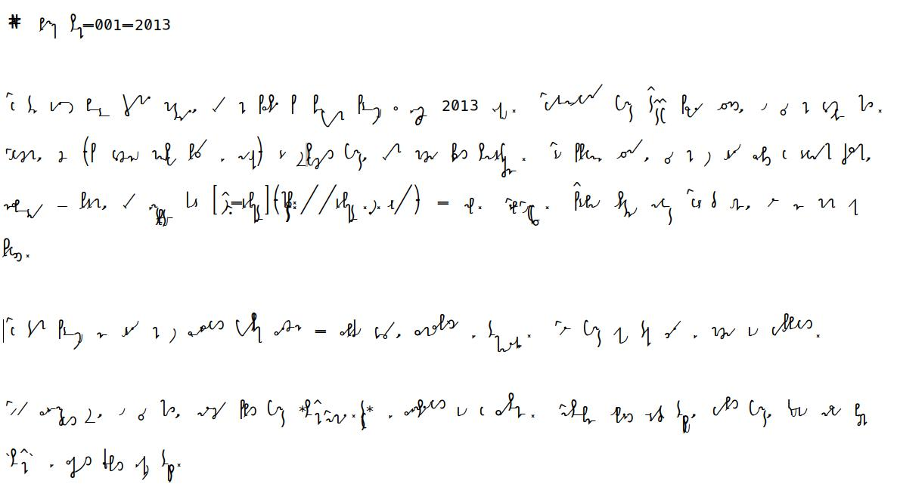

# About SteMi-font

Here we work on the font for the Polish shorthand system called SteMi. More on this you can find on  our webpage: [https://www.stenografia.pl]([https://www.stenografia.pl/](https://www.stenografia.pl/kategorie/stemi/) which is a part of a webpage about [shorthand in general](https://www.stenografia.pl). It's in Polish, so use some translate soft. 

At the current stage of development, I suppose, it's not usable in other languages, as still it's barely usable in Polish.

# Gałąź dev

Tutaj odbywają się prace nad budowaniem fontu. Rezultaty przekazywane są do gałęzi `master`

Resztę czytaj w `README.md` gałęzi `master`

Tutaj pracujemy nad czcionką dla polskiego systemu stenograficznego SteMi. W toku prac zorientowałem się niespodzianie, że jeżeli uda mi się ten projekt zakończyć, uzyskam najdoskonalszą dokumentację całego [systemu stenograficznego **Ste*Mi***](https://www.stenografia.pl/kategorie/stemi/), także dla pisma odręcznego. Tzn. ewentualny adept stenografii będzie mógł sobie zainstalować font na komputerze i zawsze sprawdzić, jaka jest sugerowana metoda pisania danego słowa (o ile sam na to wcześniej nie wpadnie).

