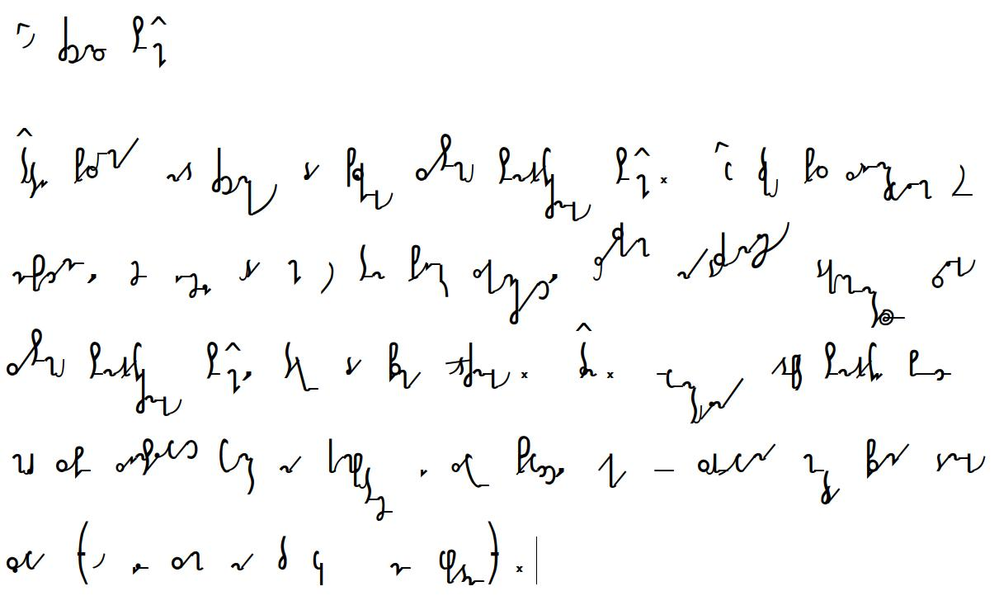

# About SteMi-font

Here we work on the font for the Polish shorthand system called SteMi. More on this you can find on  our webpage: [https://www.stenografia.pl]([https://www.stenografia.pl/](https://www.stenografia.pl/kategorie/stemi/) which is a part of a webpage about [shorthand in general](https://www.stenografia.pl). It's in Polish, so use some translate soft. 

At the current stage of development, I suppose, it's not usable in other languages, as still it's barely usable in Polish.

# O czcionce SteMi

Tutaj pracujemy nad czcionką dla polskiego systemu stenograficznego SteMi. W toku prac zorientowałem się niespodzianie, że jeżeli uda mi się ten projekt zakończyć, uzyskam najdoskonalszą dokumentację całego [systemu stenograficznego **Ste*Mi***](https://www.stenografia.pl/kategorie/stemi/), także dla pisma odręcznego. Tzn. ewentualny adept stenografii będzie mógł sobie zainstalować font na komputerze i zawsze sprawdzić, jaka jest sugerowana metoda pisania danego słowa (o ile sam na to wcześniej nie wpadnie).

## Projekt składa się z 2 części:

### Plik [FontForge](https://fontforge.org/en-US/)

Czyli plik SFD zawierający definicje kształtów, z których składają się glify. W aktualnym podejściu staram się zrealizować postulat, aby mieć jak najmniej kształtów bazowych do edycji, a opierać się o referencje w tworzeniu docelowych kształtów. W ten sposób ewentualna zmiana będzie skutkować w całym środowisku. Na razie wygląda to nieźle.

### Pliki właściwości (features, .fea) oraz skrypty generujące

W plikach tych zawarte będą wszelkie niezbędne cudności, dzięki którym będzie następować kursywne łączenie poszczególnych znaków zgodnie z założeniami pisma stenograficznego [SteMi](https://www.stenografia.pl/kategorie/stemi/). Skrypty okazały się niezbędne dla procesu testowania, gdyż w FontForge nie zawsze działa dobrze podgląd *features*. Zatem po wprowadzeniu każdej zmiany muszę wygenerować font, zainstalować go w systemie i obejrzeć na docelowym pliku zawierającym testowy tekst.

## Gałęzie projektu

Docelowo będą:

- `master`: tu znajdzie się docelowy kod źródłowy i z tego będą generowane releasy (daleka droga).
- `theory-dev` (dawniej `dev`, ale były problemy ze słowami kluczowymi): tutaj będą wszystkie śmieci i tu odbywać się będzie proces twórczy.
- np. `stemi-001-2013`: gałąź dla konkretnej wersji, albo releasu - polecam zajrzeć, znajduje się tu font TTF do sprawdzenia.

## Poniżej:

Próbka pisma fontem stenograficznym w wersji z roku 2013 (powyższy podrozdział *O czcionce SteMi*). Nowa wersja ma być znacznie lepsza:

## Historia projektu

Sprawa zaczęła się już wiele lat temu (około roku 2011), gdy stwierdziłem, że sztuka posługiwania się pismem przypomina naukę języka obcego: trzeba opanować stronę aktywną (czyli pisanie) oraz bierną (czyli czytanie). W wypadku systemu stenograficznego adept dość szybko zaczyna pisać (szybko pisać). Problem pojawia się z odczytaniem tych bazgrołów po jakimś czasie (gdy pisarz już zapomni, o czym pisał). Stenografię ułożono z myślą, aby właśnie łatwiej było pisać niż czytać, bo chodziło o to, aby nadążyć za mówiącym. A deszyfrację bazgrołów można było zrobić później, jak będzie więcej czasu. Ale dziś nikt nie ma czasu na przepisywanie notatek, powinny być czytelne w oryginale. **Czyli trening czytania to klucz**.

Z tych rozważań wyłonił się pomysł stworzenia czcionki stenograficznej, aby można było sobie drukować (generować) wybrane teksty w tej metodzie piśmiennej i ćwiczyć czytanie bez bólu przynajmniej w warstwie wyboru tekstu. [Więcej o tym na stronie o stenografii](https://www.stenografia.pl/blog/2013-10-03_co-mnie-ostatnio-odwleka-od-pisania-lekcji-stenografii/), gdzie opowiadam, jak to się zaczęło.

Po wielu latach pojawił się jeszcze jeden koncept: rozwój tzw. sztucznej inteligencji pozwala sądzić, że kiedyś będą dostępne dosłownie na wyciągnięcie ręki programy uczące się i obsługujące użytkownika niczym roboci asystenci. Wówczas trud odczytu bazgrołów będzie można scedować na nie. Ale one wcześniej muszą się dobrze nauczyć czytania. I do tego też przyda się font stenograficzny, aby móc łatwo przetranskrybować duże partie tekstu w stenografię. Taki tam pomysł. Ale daje motywację do dalszej pracy.

I tak to do dziś trwa.
